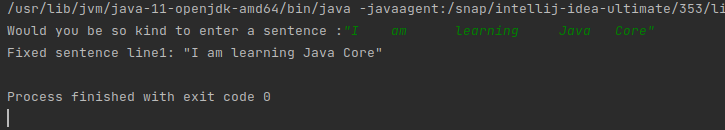

# Java Core

**Homework-10 String. Regular Expressions**

## Task-2 :

- Enter a sentence that contains the words between more than one space. 
- Convert all spaces, consecutive, one. For example:
  - Before -> "I    am      learning     Java   Core»
  - After -> "I'm learning Java Core»

Test the operation of these techniques on two pre-filled sets.

Output :

