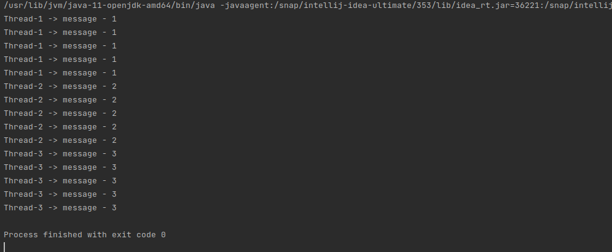

# Java Core

**Homework-12 Threads. IOFiles**

## Task-1:

Run three threads and output there different messages for 5 times. 
The third thread supposed to start after finishing working of the two previous threads.

Output :

