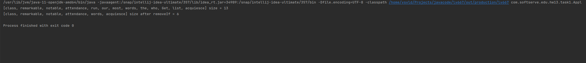

# Java Core

**Homework-13 Java 8Files**

## Task-1:

There is a list of strings list1. Create a new list list2 that has items from list1 and length less than 5 characters (use method removeIf)

Output :

