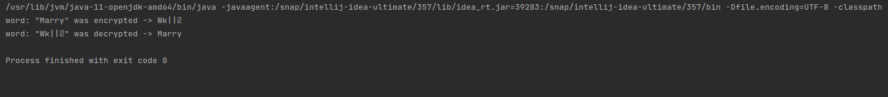

# Java Core

**Homework-13 Java 8Files**

## Task-2:

Create two methods:
- String encrypt(String s, int n) : should take a string and return coded string where every letter is moved on n positions in alphabet (e.g. encrypt("abc", 3) returns "def“).
- String decrypt(String s, int n) : should return decoded value

Output :

