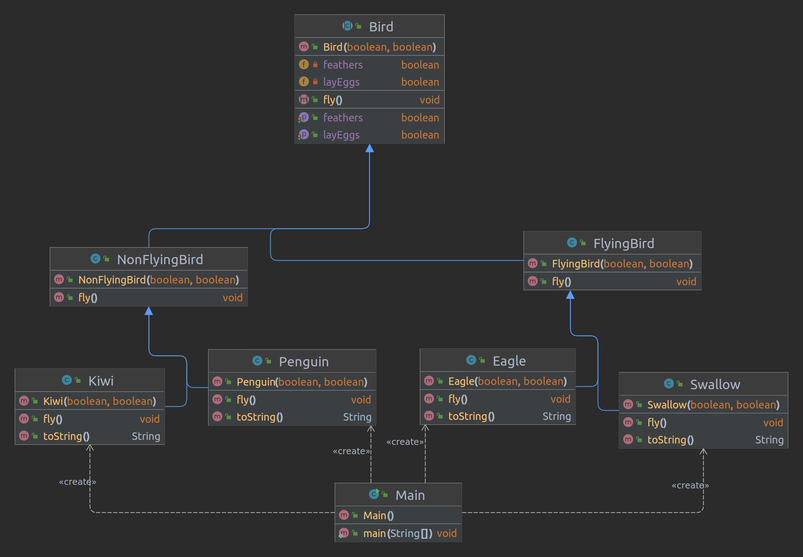

# Java Core

**Homework-6 OOP-1**

## Task-1 :
- Develop abstract class Bird with :
  - attribute feathers 
  - attributes layEggs 
  - abstarct method fly()
- Develop classes:
  - FlyingBird 
  - NonFlyingBird
  - Eagle
  - Swallow
  - Penguin 
  - Chicken.
- Create array Bird and add different birds to it.
- Call fly() method for all of it. Output the information about each type of created bird.

