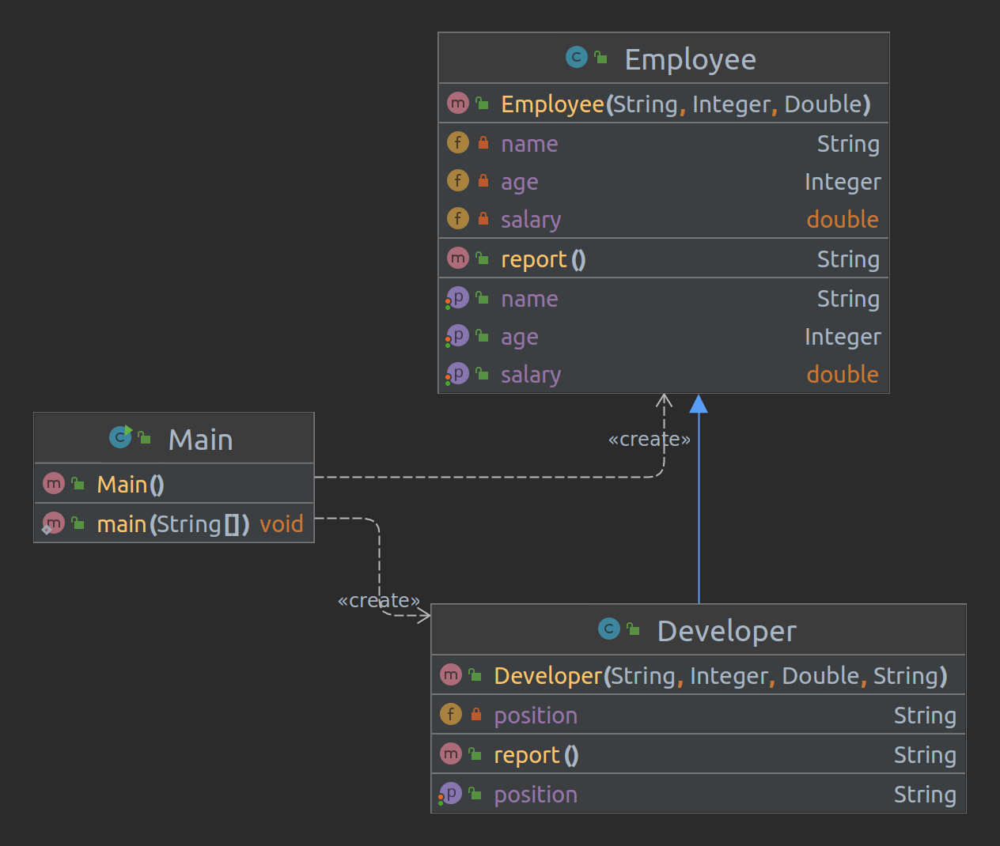

# Java Core

**Homework-6 OOP-2**

## Task-2 :
Suppose we have a class Employee
- Create a Developer class that extends the Employee class.
- Creates a String field and a constructor to initialize all fields in the Developer class
- in the Developer class, override the method report() so that it returns a string with information about the developer , for example:
  - Name: Taras, Age: 32 years, Position: Average Java developer, Salary: 32735.35
- If necessary, modify the employee's class so that it meets the principles of encapsulation and inheritance. 
Create an instance of the Employee and Developer class and print in the console information about them using report() method.

Class Diagram :
