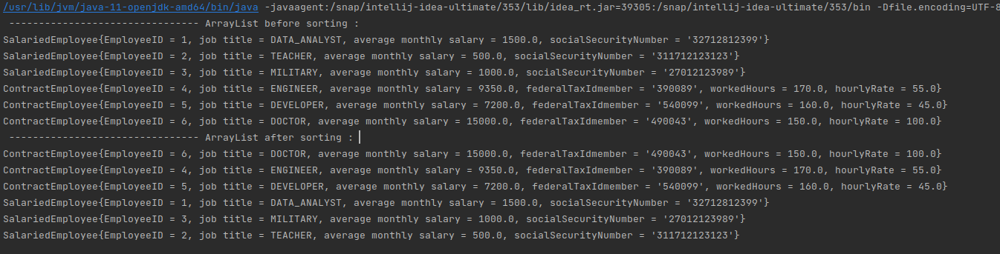
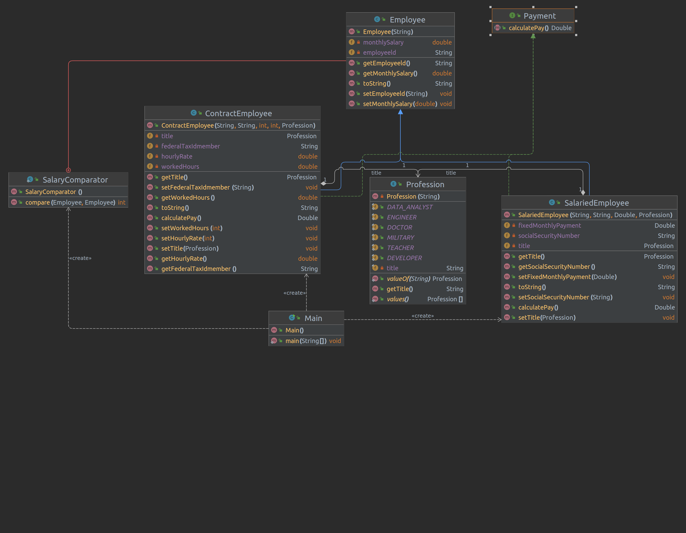

# Java Core

**Homework-7 OOP-2**

## Task-1 :
- Create:
  - Payment interface with the method calculatePay()
  - Base class Employee with a string variable employeeld
  - Class SalariedEmployee which implements interface and is inherited from the base class:
    - add string variable socialSecurityNumber
    - add variable fixed monthly payment
    - salary = fixed monthly payment
  - Class ContractEmployee which implements interface and is inherited from the base class: 
    - add string variable federalTaxIdmember
    - add variable hourly rate
    - add variable number of hours worked
    - salary = hourly rate * number of hours worked
- Create an array of employees and add the employees with different form of payment.
- Arrange the entire sequence of workers descending the average monthly wage. 
Output the employee ID, name, and the average monthly wage for all elements of the list.

Main.java Output :

Class Diagram :
