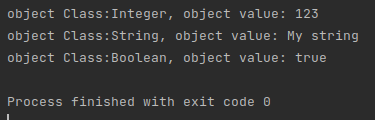
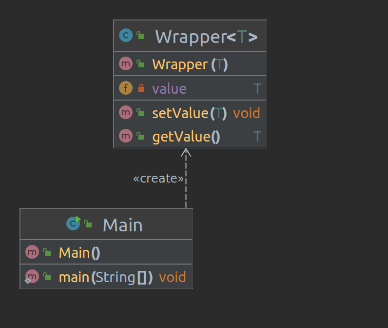

# Java Core

**Homework-8 Nested Inner Classes**

## Task-2 :
- Create Wrapper<T> class with private field of T type which is called value.
- In Wrapper class create public constructor and setValue and getValue methods for value field.
- Create three objects of the Wrapper type: 
  - first object should be wrapper for int type
  - second object for String
  - third object for boolean.
- Print all three values in the console using method getValue from Wrapper class.
  
Main.java Output :

Class Diagram :

