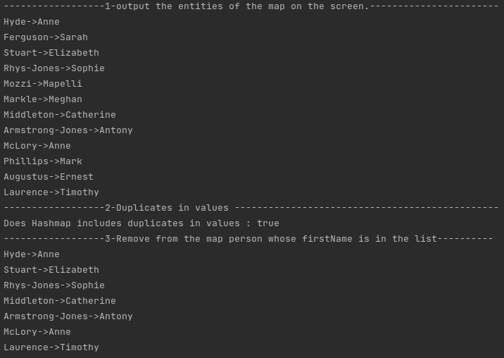

# Java Core

**Homework-9 Collections**

## Task-2 :

Create map personMap and add to it ten persons of type <String, String> (lastName, firstName).
- Output the entities of the map on the screen.
- There are at less two persons with the same firstName among these 10 people?
- Remove from the map person whose firstName is `Orest` (or other). Print result.

Output :
