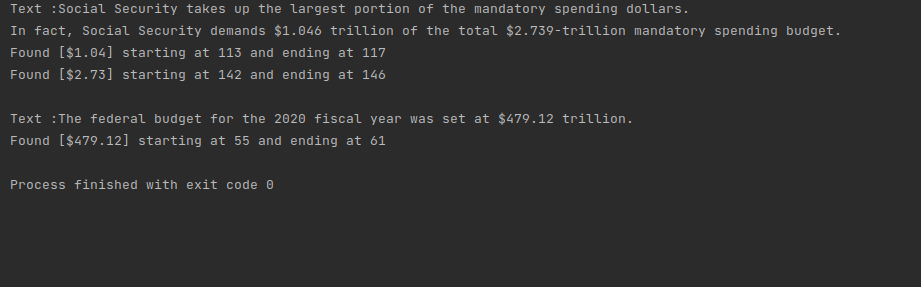

# Java Core

**Homework-10 String. Regular Expressions**

## Task-3 :

Implement a pattern for US currency: the first symbol "$", then any number of digits, dot and two digits after the dot. 
Enter the text from the console that contains several occurrences of US currency. 
Display all occurrences on the screen.

Test the operation of these techniques on two pre-filled sets.

Output :

