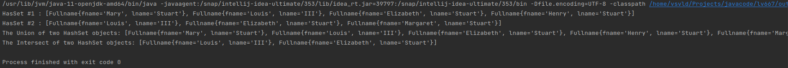

# Java Core

**Homework-9 Collections**

## Task-1 :

Write parameterized methods realizing the operations of union and intersection of two sets
  - method: union(Set set1, Set set2)
  - method: intersect(Set set1, Set set2)

Test the operation of these techniques on two pre-filled sets.

Output :
