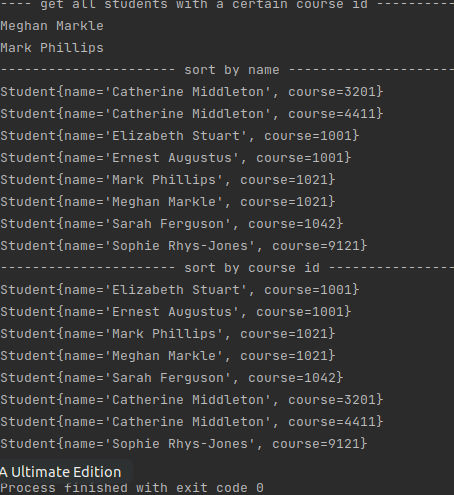

# Java Core

**Homework-9 Collections**

## Task-3 :

Write class Student that provides information about the name of the student and his course.
Class Student should consist of :
- properties for access to these fields
- constructor with parameters
- method printStudents (List students, Integer course), which receives a list of students and the course number and prints to the console the names of the students from the list, which are taught in this course (use an iterator)
- methods to compare students 
  - by name
  - by course 
- In the main() method declare List students and add to the list five different students:
  - display the list of students ordered by name
  - display the list of students ordered by course.

Output :

