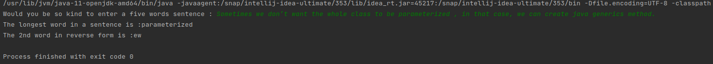

# Java Core

**Homework-10 String. Regular Expressions**

## Task-1 :

Enter in the console sentence of five words and:
- display the longest word in the sentence
- determine the number of its letters
- bring the second word in reverse order

Test the operation of these techniques on two pre-filled sets.

Output :

