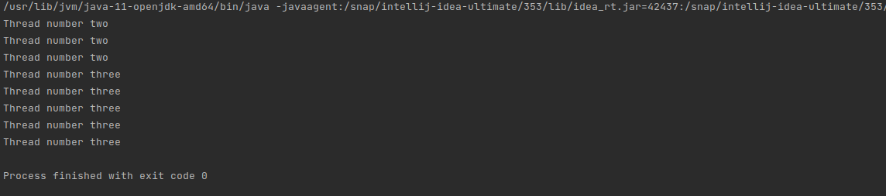

# Java Core

**Homework-12 Threads. IOFiles**

## Task-3:

Create a thread «one», which would start the thread «two», 
which has to output its number («Thread number two») 3 times and create thread «three», 
which would to output message «Thread number three» 5 times.\

Output :

