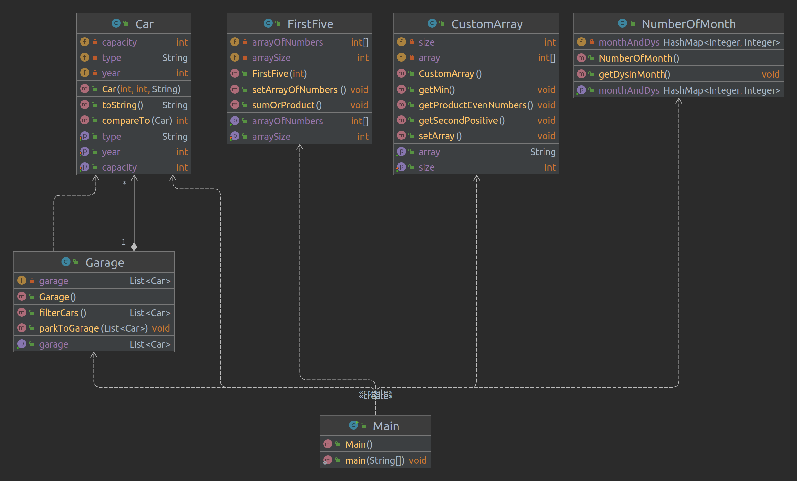

# Java Core

**Homework-5 Arrays.Loop**

## Task-1 :
- Ask user to enter the number of month. Read the value and write the amount of days in this month (create array with amount days of each month).
- Consist of:
    - class NumberOfMonth

## Task-2 :
- Enter 10 integer numbers. Calculate the sum of first 5 elements if they are positive or product of last 5 element in the other case.
- Consist of:
    - class FirstFive

## Task-3 :
- Enter 5 integer numbers and find:
    - position of second positive number
    - minimum and its position in the array
    - organize entering integers until the first negative number.
    - count the product of all entered even numbers.
- Consist of:
    - CustomArray

## Task-4 :
- Create class Car with fields type, year of production and engine capacity.
- Display cars:
    - certain model year (enter year in the console).
    - ordered by the field year.
- Consist of:
    - Car
    - Garage

